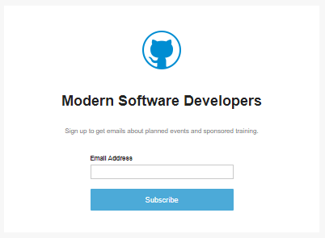

# Introduction
Learn the C# programming language with code examples.

## About the project

'Learn C#' by Anil Ripla c/o Ray Consulting Limited

### License
'Learn C#' is distributed by an MIT license.

### Contributing
When contributing to this repository, please first discuss the contribution you wish to make via issue, email, or any other method with the owners of this repository. When your contribution is approved, clone the repo, include your contribution and submit a pull request.

### Code of Conduct
We are committed to fostering a welcoming community.

## Membership

Join our membership list to find out about upcoming events and sponsored training sessions in your area.

[Sign up in the Membership List](https://mailchi.mp/98f6f104b079/moderndoftware)

## Sponsorship

Become  a sponsor for meet-ups, conferences or training events. Contact us to become a sponsor via email or create an issue. You can sponsor a training event for your own employees or public members.
